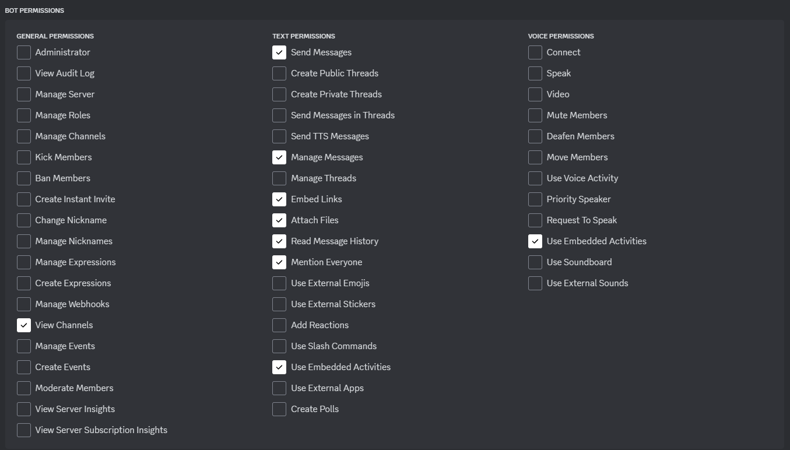

# TIC-TAC-TOE DISCORD BOT
> This is a simple tic-tac-toe game implemented in discord bot made using [discord.py](https://discordpy.readthedocs.io/en/stable/)

## SETTING UP
1. Installing\
    Use git commands to clone the repository and setup python venv with python@3.11.1
    ```bash
    cd <working-directory>
    git clone https://github.com/Raman-Shakya/DiscordBot-TicTacToe
    cd DiscordBot-TicTacToe

    python -m venv env
    .\env\Scripts\activate.bat
    pip install -r requirements.txt
    ```

2. Setting up Discord Bot\
    1. Goto [discord's developers portal](https://discord.com/developers/applications)
    2. Create a `New Application` with name of your choice
    3. Goto `Bot` section
    4. Check on `Message Content Intent`
    5. Copy `Token` by clicking on `Reset Token`
    6. Goto `OAuth2` section and to `OAuth2 URL Generator` and select `bot`
    7. New `BOT PERMISSIONS` sections should be created, select required permissions\
        
    8. Select `Guild Install` and open the `GENERATED URL` and select the server you want this bot to add to.    

3. Configuring App\
    We need to let the program know that they it is controlling the bot we just created, for this we create a .env file in the project scope
    ```bash
    echo > .env
    ```
    and edit the `.env` file to 
    ```
    TOKEN=<Token-copied from discord developers portal earlier>
    ```
    this token is read in `main.py` and logged in using
    ```python
    client.run(os.getenv('TOKEN'))
    ```

4. Run the `main.py` file to start the bot, you should see the bot in the server active after running the code.

---

## Help Command
* Use `help` command to list all the commands available in the bot.
* The positions are mapped accordingly.\
    

---

## BOT Modes
There are two modes of the bot
1. Single Player
2. Multi Player

### Single Player
Here, only one person can play the game, it plays with `AI` which was implemented using [minimax](https://en.wikipedia.org/wiki/Minimax) algorithm.\
Type `mode single` to switch to single player mode\

> you can also set difficulty level from 1 to 9 using `difficulty` command

### Multi Player
<p>Here, two players can play the game, first player is assigned to play for `X` and the second player is assigned to play for `O`. The turns alternate in standard Tic-Tac-Toe Game.</p>
Type `mode multi` to switch to multi player mode.\


---

## Player Setup
* To play the game players should type the `play` command first.\
    
* Players can exit the game by typing the `exit` command.\
    
* If the game hasn't started yet, the modes are automatically selected when players enter the game.

---

## Game Play
* Game is played using the `place` command followed by the position given by\
    
* Use the `reset` command to reset the game.\
    

---

## Appearance
* Use `show` command to show the current state of the game.\
    
* Use `change background` command with attached background image to change the background of the board.\
    
* Use `change X` command with attached image for `X` to change the image for `X`.\
    
* Use `change O` command with attached image for `O` to change the image for `O`.\
    
* Use `reset images` to change all images to default image.\
    

---

## Contribute
* You can fork this repository and make changes and finally request a pull request to merge your changes in this repository.
* If you find any issues with this repository then you may open a issue on [`issues`](https://github.com/Raman-Shakya/DiscordBot-TicTacToe/issues) section